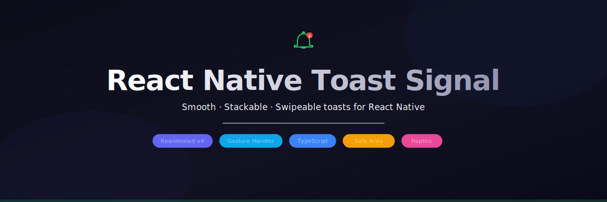

<p align="center">
  
</p>

<p align="center">
  
  
  
  
</p>

<br/>

**react-native-toast-signal** is a smooth, stackable, fully typed toast notification library for React Native — built on [Reanimated v4](https://docs.swmansion.com/react-native-reanimated/) and [Gesture Handler v2](https://docs.swmansion.com/react-native-gesture-handler/).

- 🎞 **Fluid animations** — slide-in/out, stacked scale + opacity, progress bar
- 👆 **Swipe-to-dismiss** with flick velocity detection
- 📚 **Queue-aware stacking** — beyond `maxVisible` toasts are mounted but hidden, animating in seamlessly when a slot opens
- 🔔 **6 types** — `success` `error` `warning` `info` `loading` `custom`
- ⚡ **Loading toasts** — update in-place to success/error with a pulse animation
- 🎯 **Action buttons** — optional CTA rendered inside the toast
- ♿ **Accessible** — `accessibilityRole`, `accessibilityLiveRegion`, and `AccessibilityInfo` announcements
- 📍 **Position** — `top` or `bottom` per toast, with safe area clamping
- 🎨 **Fully themeable** per type

---

## Installation

```sh
npm install react-native-toast-signal
```

### Peer dependencies

Install if not already in your project:

```sh
npm install react-native-reanimated react-native-worklets react-native-gesture-handler react-native-safe-area-context
```

> **Reanimated v4 requires the New Architecture.** Make sure it's enabled in your project.

### babel.config.js

```js
module.exports = {
  presets: ['module:@react-native/babel-preset'],
  plugins: [
    'react-native-worklets/plugin', // required for Reanimated v4
  ],
};
```

## Setup

Wrap your app root with the required providers **in this exact order**:

```tsx
import { GestureHandlerRootView } from 'react-native-gesture-handler';
import { SafeAreaProvider } from 'react-native-safe-area-context';
import { SignalProvider } from 'react-native-toast-signal';

export default function App() {
  return (
    <GestureHandlerRootView style={{ flex: 1 }}>
      <SafeAreaProvider>
        <SignalProvider>
          <YourApp />
        </SignalProvider>
      </SafeAreaProvider>
    </GestureHandlerRootView>
  );
}
```

---

## Usage

### Imperative API

```ts
import { Signal } from 'react-native-toast-signal';

// Simple
Signal.show({ description: 'Profile saved.' });

// With title and type
Signal.show({
  type: 'success',
  title: 'Changes saved',
  description: 'Your profile has been updated successfully.',
});

// Error
Signal.show({
  type: 'error',
  title: 'Upload failed',
  description: 'Check your connection and try again.',
});

// Warning
Signal.show({
  type: 'warning',
  description: 'Your session expires in 5 minutes.',
});

// Info — bottom position
Signal.show({
  type: 'info',
  description: 'New update available.',
  position: 'bottom',
});

// Dismiss a specific toast
Signal.hide('my-toast-id');

// Dismiss all
Signal.clear();
```

### Hook API

```tsx
import { useSignal } from 'react-native-toast-signal';

function MyComponent() {
  const { show, hide, clear } = useSignal();

  return (
    <Button
      title="Save"
      onPress={() =>
        show({
          type: 'success',
          title: 'Saved',
          description: 'All changes have been saved.',
        })
      }
    />
  );
}
```

---

## Loading Toasts

Show a loading toast, then update it in-place to success or error — no flash, just a smooth pulse transition:

```ts
Signal.show({
  id: 'upload',
  type: 'loading',
  description: 'Uploading file…',
  autoHide: false, // stays until you call update
});

try {
  await uploadFile();
  Signal.update('upload', {
    type: 'success',
    description: 'File uploaded!',
    autoHide: true,
  });
} catch {
  Signal.update('upload', {
    type: 'error',
    description: 'Upload failed. Try again.',
    autoHide: true,
  });
}
```

---

## Action Buttons

Render a CTA inside the toast. The `onPress` callback receives a `dismiss` function so you control whether the toast closes:

```ts
Signal.show({
  type: 'warning',
  title: 'Unsaved changes',
  description: 'You have unsaved changes. Discard them?',
  autoHide: false,
  action: {
    label: 'Discard',
    onPress: (dismiss) => {
      discardChanges();
      dismiss();
    },
  },
});
```

---

## onPress

The `onPress` callback also receives a `dismiss` function:

```ts
Signal.show({
  type: 'info',
  description: 'New message from Alex.',
  onPress: (dismiss) => {
    navigation.navigate('Chat');
    dismiss();
  },
});
```

---

## Callbacks

```ts
Signal.show({
  description: 'Processing complete.',
  onShow: () => console.log('Toast entered'),
  onHide: () => console.log('Toast exited'),
});
```

| Callback  | When it fires                        |
| --------- | ------------------------------------ |
| `onShow`  | After entry animation fully settles  |
| `onHide`  | After exit animation fully completes |
| `onPress` | When the toast body is tapped        |

---

## Custom Icon

Override the default type icon with any `ReactNode`:

```tsx
import { MyIcon } from './icons';

Signal.show({
  type: 'custom',
  description: 'Custom icon toast.',
  icon: <MyIcon size={16} color="#a78bfa" />,
});
```

---

## API Reference

### `Signal`

| Method                       | Description                     |
| ---------------------------- | ------------------------------- |
| `Signal.show(options)`       | Show a new toast                |
| `Signal.hide(id)`            | Dismiss a specific toast by ID  |
| `Signal.update(id, options)` | Update a visible toast in-place |
| `Signal.clear()`             | Dismiss all toasts              |

### `SignalOptions`

| Prop             | Type                            | Default  | Description                                                                    |
| ---------------- | ------------------------------- | -------- | ------------------------------------------------------------------------------ |
| `description`    | `string`                        | —        | **Required.** Body text                                                        |
| `title`          | `string`                        | —        | Optional bold heading                                                          |
| `id`             | `string`                        | auto     | Stable ID for deduplication / update / hide                                    |
| `type`           | `SignalType`                    | `'info'` | Visual style: `success` `error` `warning` `info` `loading` `custom`            |
| `position`       | `'top' \| 'bottom'`             | `'top'`  | Screen position                                                                |
| `duration`       | `number`                        | `3000`   | Auto-dismiss delay in ms                                                       |
| `autoHide`       | `boolean`                       | `true`   | Disable to keep toast until manually dismissed (`loading` defaults to `false`) |
| `swipeToDismiss` | `boolean`                       | `true`   | Enable or disable swipe gesture                                                |
| `action`         | `SignalAction`                  | —        | Optional CTA button with label and onPress                                     |
| `icon`           | `ReactNode`                     | —        | Custom icon — replaces the default type icon                                   |
| `onShow`         | `() => void`                    | —        | Called after entry animation settles                                           |
| `onHide`         | `() => void`                    | —        | Called after exit animation completes                                          |
| `onPress`        | `(dismiss: () => void) => void` | —        | Called when toast body is tapped                                               |

### `SignalProvider` props

| Prop              | Type     | Default | Description                           |
| ----------------- | -------- | ------- | ------------------------------------- |
| `maxVisible`      | `number` | `3`     | Max toasts shown in the stack at once |
| `defaultDuration` | `number` | `3000`  | Global default auto-dismiss duration  |

```tsx
<SignalProvider maxVisible={5} defaultDuration={4000}>
  <App />
</SignalProvider>
```

### `SignalAction`

```ts
interface SignalAction {
  label: string;
  onPress: (dismiss: () => void) => void;
}
```

---

## Theming

Pass a partial theme to `SignalProvider` to override colors per type:

```tsx
<SignalProvider
  theme={{
    success: {
      background: '#052e16',
      border: '#22c55e60',
      titleColor: '#ffffff',
      descriptionColor: '#bbf7d0',
      iconColor: '#4ade80',
    },
  }}
>
  <App />
</SignalProvider>
```

Each type accepts a `SignalTypeTheme`:

```ts
interface SignalTypeTheme {
  background: string;
  border: string;
  titleColor: string;
  descriptionColor: string;
  iconColor: string;
}
```

---

## Requirements

| Package                          | Version    |
| -------------------------------- | ---------- |
| `react-native`                   | `>= 0.74`  |
| `react-native-reanimated`        | `>= 4.0.0` |
| `react-native-worklets`          | `>= 0.4.0` |
| `react-native-gesture-handler`   | `>= 2.0.0` |
| `react-native-safe-area-context` | `>= 4.0.0` |

---

## License

MIT © 2026
